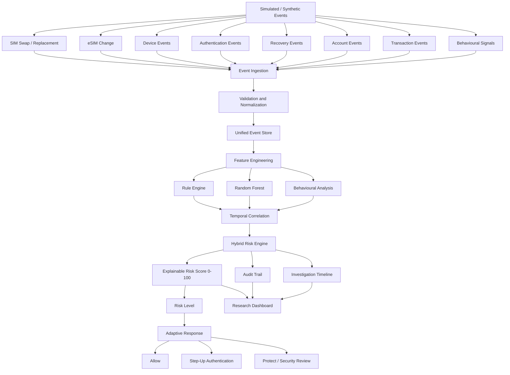

 # System Architecture

## 1. Project Objective

The system detects potential account takeover risk following SIM/eSIM-related events by correlating telecom, device, authentication, account-recovery, behavioural and transaction signals.

A SIM change is treated as a trigger/context signal and not as proof of fraud.

## 2. Core Telecom Events

- SIM_SWAP
- SIM_REPLACEMENT
- ESIM_CHANGE

Number Porting / MNP is outside the core implementation scope.

## 3. High-Level Architecture

## 4. Data Flow

1. Synthetic or simulated events enter the system.
2. Events are validated and normalized.
3. Events are stored using a common event structure.
4. Features are extracted from the event history.
5. Rule-based, ML and behavioural analysis are performed.
6. Events are correlated over time.
7. The hybrid risk engine generates an explainable risk score.
8. The score is mapped to a risk level.
9. A risk-based response is produced.
10. Results are exposed to the research dashboard and audit trail.

## 5. Core Processing Components

### Event Ingestion

Accepts simulated project events.

### Event Normalization

Converts different event types into a common schema.

### Feature Engineering

Creates model and rule features from historical and contextual events.

### Rule Engine

Provides the rule-based baseline for comparison.

### Random Forest Model

Provides the primary machine-learning baseline.

### Behavioural Analysis

Measures deviation from the user's historical behavioural baseline.

### Temporal Correlation

Analyses combinations of events occurring within relevant time relationships.

### Hybrid Risk Engine

Combines the outputs of the rule, ML, behavioural and temporal analysis components.

## 6. Risk Output

The system produces:

- Risk score: 0-100
- Risk level: Low / Medium / High
- Recommended action:
  - Allow
  - Step-Up Authentication
  - Protect / Security Review

Exact thresholds and scoring weights will be determined during experimentation and must not be assumed during architecture design.

## 7. Research Comparison

The research evaluation compares:

1. SIM-only baseline
2. Multi-signal rule-based approach
3. Random Forest model
4. Hybrid approach with temporal correlation

## 8. Core Database Entities

- User
- Device
- Event
- Transaction
- BehaviourProfile
- FeatureSnapshot
- RiskAssessment
- RiskDecision
- AuditLog

## 9. API Boundary

Initial API design:

- POST `/events`
- GET `/events/{user_id}`
- POST `/risk/assess`
- GET `/risk/{user_id}`
- GET `/users/{user_id}`
- GET `/users/{user_id}/timeline`
- GET `/dashboard/summary`
- GET `/health`

These endpoints define the initial interface and will be implemented in a later phase.

## 10. Out of Scope

- Real telecom integration
- Real banking integration
- Real customer PII
- OTP interception
- Production account blocking
- Number-porting subsystem
- Deep learning
- Graph neural networks
- Blockchain
- GIS subsystem
- Cash-out prediction
- Kafka/streaming infrastructure
- Production deployment
- Docker/container deployment

## 11. Research Question

Does multi-signal temporal correlation after a SIM/eSIM event improve account-takeover risk detection compared with simpler rule-based or ML-only approaches?